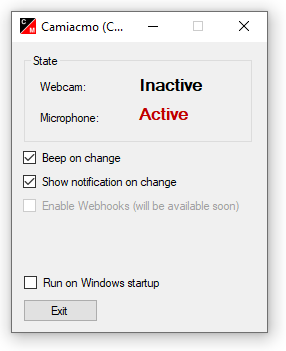

# Camera and Microphone Activity Monitor (CaMiAcMo)

Build to use with SmartHome-Control (e.g. iobroker), Remote-LEDs (e.g. Wemos Mini D1) or just a standalone solution for your Homeoffice-Setup.

# [Download latest version](https://github.com/askeron/camiacmo/releases/latest/download/Camiacmo.exe)

Inspired by [S.H.I.E.L.D](https://github.com/tlevis/S.H.I.E.L.D/)
